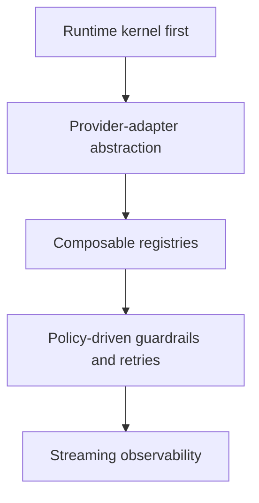
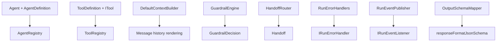
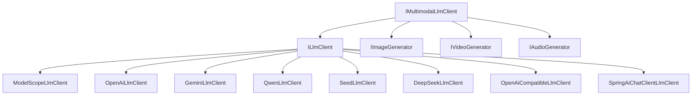
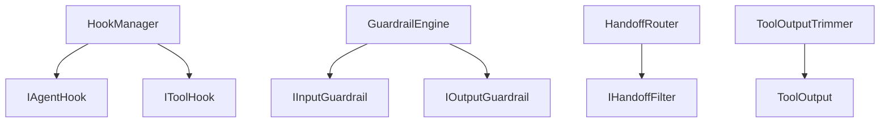

# GUNDAM-core Project Architecture and Code Structure

## 1. Runtime Architecture (Current State)

```mermaid
graph TD
    A[AgentRunner] --> B[IAgentRegistry]
    A --> C[IToolRegistry]
    A --> D[IContextBuilder]
    A --> E[HookManager]
    A --> F[GuardrailEngine]
    A --> G[HandoffRouter]
    A --> H[ISessionStore]
    A --> I[ITraceProvider]
    A --> J[IToolApprovalPolicy]
    A --> K[OutputSchemaRegistry]
    A --> L[OutputValidator]
    A --> M[RunEventPublisher]

    A --> N[ILlmClient]
    N --> O[LlmRequest]
    N --> P[LlmResponse]

    A --> Q[RunConfiguration]
    A --> R[RunnerContext]
    R --> S[IAgentMemory]
    R --> T[TokenUsage]
    R --> U[RunItem timeline]

    A --> V[Tool call loop]
    V --> W[ITool]
    V --> X[ToolApprovalRequest/ToolApprovalDecision]
``` 

## 2. Design Principles

## 3. Key Components

## 4. Provider Agnostic Layer

## 5. Extension Points

