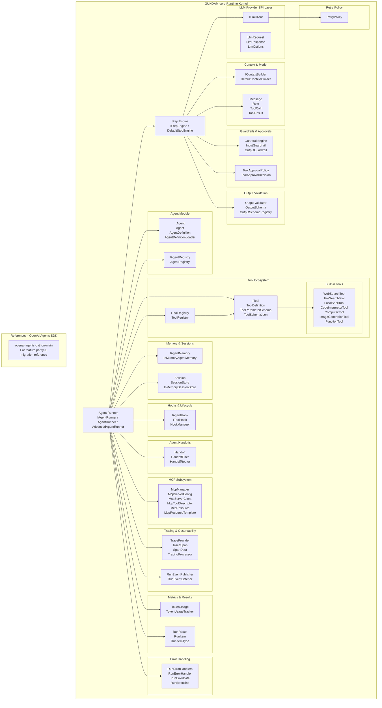

# GUNDAM-core Project Architecture and Code Structure

## 1. Comprehensive Mermaid Architecture Diagram



## 2. Project Overview

**GUNDAM-core** (Generic Ultimate Neural-linked Data-driven AI Model Core) is a modular, provider-agnostic, declarative-first Agent Runtime Kernel. It is implemented in Java (targeting Java 17) and aims to be 100% feature-compatible with OpenAI's Agents SDK while adding enterprise-grade capabilities.

### Key Design Principles
- **Declarative First**: Agents defined as JSON, database-storable, runtime-reloadable
- **Runtime-Centric**: Not a wrapper - implements full step execution engine
- **Strict Separation of Concerns**: No tenant/auth/business logic
- **Provider Agnostic**: LLM access via `ILlmClient` SPI
- **Extensible by Hooks**: Agent and Tool lifecycle hooks

## 3. Detailed Navigation Guide & Optimal Learning Sequence

Here's the best order to understand and navigate the codebase:

### Phase 1: Foundation & Core Abstractions (Start Here!)
1. **`model/`** - Understand basic data structures
   - `Message.java`, `Role.java`, `ToolCall.java`, `ToolResult.java` - the core message types
2. **`llmspi/`** - Learn about provider-agnostic LLM interface
   - `ILlmClient.java` - the SPI contract
   - `LlmRequest.java`, `LlmResponse.java`, `LlmOptions.java` - request/response models

### Phase 2: Agent Core
3. **`agent/`** - Agent definitions and registry
   - `IAgent.java` - agent interface
   - `Agent.java` - concrete implementation
   - `AgentDefinition.java` - declarative agent definition
   - `AgentDefinitionLoader.java` - loads agents from JSON
   - `IAgentRegistry.java`, `AgentRegistry.java` - agent registration

### Phase 3: Runtime Execution (The Engine!)
4. **`runtime/` and `runner/`** - Execution engine and step loop
   - `IAgentRunner.java`, `AgentRunner.java` - basic agent runner
   - `AdvancedAgentRunner.java` - enhanced runner (with more features)
   - `IStepEngine.java`, `DefaultStepEngine.java` - step execution loop
   - `ExecutionContext.java` - context for execution
   - Check `runtime/` package first, then `runner/` for advanced features

### Phase 4: Memory & Session
5. **`memory/`** - Conversation memory
   - `IAgentMemory.java`, `InMemoryAgentMemory.java`
6. **`session/`** - Session persistence
   - `Session.java`, `SessionStore.java`, `InMemorySessionStore.java`

### Phase 5: Tool System
7. **`tool/`** - Tool definitions and execution
   - `ITool.java`, `ToolDefinition.java`, `ToolParameterSchema.java`, `ToolSchemaJson.java`
   - `IToolRegistry.java`, `ToolRegistry.java`
   - `tool/builtin/` - explore the built-in tools (WebSearch, FileSearch, etc.)

### Phase 6: Advanced Features
8. **`hook/`** - Lifecycle hooks
   - `IAgentHook.java`, `IToolHook.java`, `HookManager.java`
9. **`handoff/`** - Agent-to-agent handoffs
   - `Handoff.java`, `HandoffFilter.java`, `HandoffRouter.java`
10. **`guardrail/`** - Input/output guardrails
    - `GuardrailEngine.java`, `InputGuardrail.java`, `OutputGuardrail.java`
11. **`approval/`** - Tool approval policies
    - `ToolApprovalPolicy.java` - human-in-the-loop style gating
12. **`mcp/`** - MCP (Model Context Protocol) subsystem
    - `McpManager.java`, `McpServerConfig.java`, `McpServerClient.java`
13. **`tracing/`** - Observability and tracing
    - `TraceProvider.java`, `TraceSpan.java`, `TracingProcessor.java`
14. **`streaming/`** - Event streaming
    - `RunEventPublisher.java`, `RunEventListener.java`
15. **`metrics/`** - Token usage tracking
    - `TokenUsage.java`, `TokenUsageTracker.java`
16. **`result/`** - Run results and timeline
    - `RunResult.java`, `RunItem.java`, `RunItemType.java`
17. **`output/`** - Structured output validation
    - `OutputValidator.java`, `OutputSchema.java`
18. **`policy/`** - Retry policies
    - `RetryPolicy.java`
19. **`runerror/`** - Error handling
    - `RunErrorHandlers.java`, `RunErrorHandler.java`
20. **`context/`** - Context building
    - `IContextBuilder.java`, `DefaultContextBuilder.java`
21. **`errors/`** - Typed exceptions
    - Various exception types

### Phase 7: References & Inspiration
22. **`references/openai-agents-python-main/`** - OpenAI Agents SDK source code for feature parity reference

### Phase 8: Tests
23. **`test/`** - Test files to understand usage patterns
    - `runtime/AgentRuntimeTest.java` - basic runtime tests
    - `runtime/AdvancedAgentRunnerTest.java` - advanced runner tests
    - `runner/McpAndErrorHandlingTest.java` - MCP and error handling tests
    - `tracing/TracingProcessorTest.java` - tracing tests

## 4. Core Module Architecture Summary

| Module | Responsibility | Key Files |
|--------|----------------|-----------|
| `agent/` | Agent definitions, loading, and registry | `IAgent.java`, `Agent.java`, `AgentDefinition.java`, `AgentRegistry.java` |
| `runtime/` + `runner/` | Execution engine and step loop | `IAgentRunner.java`, `AgentRunner.java`, `AdvancedAgentRunner.java`, `DefaultStepEngine.java` |
| `tool/` | Tool definitions, registry, and built-in tools | `ITool.java`, `ToolRegistry.java`, `builtin/` package |
| `llmspi/` | Provider-agnostic LLM interface | `ILlmClient.java`, `LlmRequest.java`, `LlmResponse.java` |
| `memory/` + `session/` | Conversation memory and session persistence | `IAgentMemory.java`, `SessionStore.java` |
| `hook/` | Lifecycle hooks | `IAgentHook.java`, `IToolHook.java`, `HookManager.java` |
| `handoff/` | Agent-to-agent handoffs | `Handoff.java`, `HandoffFilter.java`, `HandoffRouter.java` |
| `guardrail/` | Input/output guardrails | `GuardrailEngine.java` |
| `approval/` | Tool approval | `ToolApprovalPolicy.java` |
| `mcp/` | MCP subsystem | `McpManager.java`, `McpServerClient.java` |
| `tracing/` | Observability | `TraceProvider.java`, `TracingProcessor.java` |
| `streaming/` | Event streaming | `RunEventPublisher.java` |
| `metrics/` | Token usage | `TokenUsageTracker.java` |
| `result/` | Run results | `RunResult.java` |
| `output/` | Output validation | `OutputValidator.java` |
| `policy/` | Retry policy | `RetryPolicy.java` |
| `runerror/` | Error handling | `RunErrorHandlers.java` |

## 5. Key Entry Points

For understanding the runtime flow:
1. **`AgentRunner.java`** - Basic runner
2. **`AdvancedAgentRunner.java`** - Enhanced runner with more capabilities
3. **`DefaultStepEngine.java`** - Implements the core step-by-step execution loop (the heart of the kernel!)

For understanding how components interact:
- Check the test files in `test/` directory for working examples

## 6. Core Runtime Loop (from README)

```
while not finished:
    render context
    call model
    track token usage

    if model requests tool:
        execute tool
        append tool result to memory
    else:
        return final answer
```

## 7. Recent Fixes

- **Guardrail Fix (2026-02-18)**: Fixed issues in `AdvancedAgentRunner.java` where:
  - `GUARDRAIL_BLOCKED` event was not emitted when a guardrail trips
  - Final output message did not match test expectations ("Blocked by input guardrail")
