# GUNDAM-core Project Architecture and Code Structure

## 1. Runtime Architecture (Current State)

```mermaid
graph TD
    subgraph "GUNDAM-core Runtime Kernel"
        A[AgentRunner]
        B[ILlmClient / IMultimodalLlmClient]
        C[ToolRegistry]
        D[AgentRegistry]
        E[ContextBuilder]
        F[Memory + SessionStore]
        G[GuardrailEngine]
        H[HandoffRouter]
        I[HookManager]
        J[RunErrorHandlers + RetryPolicy]
        K[Tracing + RunEventPublisher]
        L[OutputValidator]
        M[MCP Manager]
        N[ToolApprovalPolicy]

        A --> B
        A --> C
        A --> D
        A --> E
        A --> F
        A --> G
        A --> H
        A --> I
        A --> J
        A --> K
        A --> L
        A --> M
        A --> N
    end

    subgraph "Tracing Pipeline"
        O[ProcessorTraceProvider]
        P[ITracingProcessor]
        Q[TracingProcessors]
        R[SpanData / ToolSpanData / GenerationSpanData]
        S[TraceEvent]

        O --> P
        O --> Q
        P --> R
        P --> S
    end

    subgraph "Provider Adapter Layer"
        T[OpenAiLlmClient]
        U[GeminiLlmClient]
        V[QwenLlmClient]
        W[SeedLlmClient]
        X[DeepSeekLlmClient]
        Y[SpringAiChatClientLlmClient]
        Z[OpenAiCompatibleLlmClient]

        T -.-> B
        U -.-> B
        V -.-> B
        W -.-> B
        X -.-> B
        Y -.-> B
        Z -.-> B
    end

    subgraph "Contract & Extension Layers"
        AA[realtime: IRealtimeClient / IRealtimeSession]
        AB[voice: IVoicePipeline + contracts]
        AC[extensions: HandoffHistoryFilters + ToolOutputTrimmer]
        AD[multimodal: MessagePart / IImageGenerator etc.]
        AE[builtin tools: web/file/shell/computer/code/image/video/function]
        AF[mcp tools: HostedMcpTool]

        A --> AC
        B --> AA
        B --> AB
        B --> AD
        C --> AE
        C --> AF
    end

    K --> O
```



## 2. Comprehensive Comparison with OpenAI Agents SDK

Scope used for comparison:
- OpenAI reference source: `references/openai-agents-python-main/src/agents/**`
- GUNDAM-core source: `src/main/java/stark/dataworks/coderaider/gundam/core/**`

### Feature parity status table

| OpenAI Agents SDK capability | OpenAI reference area | GUNDAM-core implementation | Status |
|---|---|---|---|
| Agent abstraction + registry | `agent.py` | `agent/` (`Agent`, `AgentDefinition`, `AgentRegistry`, `AgentDefinitionLoader`) | ✅ Implemented |
| Run loop (multi-turn, max-turn) | `run.py`, `run_internal/run_loop.py` | `runner/AgentRunner`, `runner/RunConfiguration`, `runner/RunnerContext` | ✅ Implemented |
| Tool registration + tool calling | `tool.py`, `run_internal/tool_execution.py` | `tool/`, built-ins + runner tool loop + `ToolExecutionContext` | ✅ Implemented |
| Tool approval workflow | `run_internal/approvals.py` | `approval/` + runner integration + MCP tool approval | ✅ Implemented |
| Handoffs / routing | `handoffs/*`, `realtime/handoffs.py` | `handoff/` + runner handoff flow + `IHandoffFilter` | ✅ Implemented |
| Guardrails (input/output) | `guardrail.py`, `run_internal/guardrails.py` | `guardrail/` + guardrail exceptions + `GuardrailEngine` | ✅ Implemented |
| Session persistence abstraction | `memory/session.py` and implementations | `session/ISessionStore`, `InMemorySessionStore`, `Session` | ✅ Implemented |
| In-memory conversation memory | `memory/session.py` | `memory/InMemoryAgentMemory` | ✅ Implemented |
| Structured output / schema strictness | `strict_schema.py`, `agent_output.py` | `output/` (`OutputValidator`, `OutputSchemaRegistry`, `IOutputSchema`) | ✅ Implemented |
| Run events + stream events | `stream_events.py` | `event/`, `streaming/RunEventPublisher`, `IRunEventListener` | ✅ Implemented |
| Tracing provider + processors + span data | `tracing/*` | `tracing/` + `tracing/processor/` + `tracing/data/` | ✅ Implemented |
| MCP manager/server/tool mapping | `mcp/*` | `mcp/` + `tool/builtin/mcp/HostedMcpTool` + MCP approval policies | ✅ Implemented |
| Multimodal message parts + generation contracts | `items.py`, model I/O helpers | `multimodal/` + `IMultimodalLlmClient` + generators | ✅ Implemented |
| Built-in tools (web/file/shell/computer/code/image/video/function) | `computer.py`, `tool.py` ecosystem | `tool/builtin/*` | ✅ Implemented |
| Run error handler pipeline | `run_error_handlers.py`, `run_internal/error_handlers.py` | `runerror/` + runner integration | ✅ Implemented |
| Tool output trimming extension | `extensions/tool_output_trimmer.py` | `extensions/ToolOutputTrimmer` | ✅ Implemented |
| Handoff history filters extension | `extensions/handoff_filters.py` | `extensions/HandoffHistoryFilters` | ✅ Implemented |
| Realtime session contracts | `realtime/*` | `realtime/*` contracts/events/config | 🟨 Partial (contract layer added) |
| Voice workflow contracts | `voice/*` | `voice/*` contracts/config/result/exception | 🟨 Partial (contract layer added) |
| REPL / visualization helpers | `repl.py`, `extensions/visualization.py` | No direct equivalent yet | ❌ Not implemented |
| Provider adapters (OpenAI/Gemini/Qwen/Seed/DeepSeek + Spring AI bridge) | `models/*` | `llmspi/adapter` with OpenAI-compatible adapters + `SpringAiChatClientLlmClient` | ✅ Implemented |
| Tracing span data types (Tool/Generation/Span) | `tracing/span_data.py` | `tracing/data/SpanData`, `ToolSpanData`, `GenerationSpanData` | ✅ Implemented |
| Tracing processor pipeline | `tracing/processor_interface.py`, `processors.py` | `tracing/processor/ITracingProcessor`, `TracingProcessors` | ✅ Implemented |

## 3. Package Structure Breakdown

### Core Runtime
- `agent/`: Agent definition, registry, and loader
- `runner/`: Main execution loop and configuration
- `runtime/`: Execution context
- `hook/`: Lifecycle hooks (AgentHook, ToolHook)

### Model & Memory
- `llmspi/`: Provider-agnostic LLM interface
- `llmspi/adapter/`: Concrete provider implementations
- `memory/`: Conversation memory
- `session/`: Session persistence
- `model/`: Message, Role, ToolCall, ToolResult

### Tools & Extensions
- `tool/`: Tool abstraction, registry, and built-ins
- `tool/builtin/`: Web, File, Shell, Computer, Code, Image, Video, Function tools
- `tool/builtin/mcp/`: MCP-hosted tools
- `extensions/`: HandoffHistoryFilters, ToolOutputTrimmer
- `mcp/`: MCP manager, server client, resources, approval

### Control Flow
- `handoff/`: Agent-to-agent handoff
- `guardrail/`: Input/output guardrails
- `approval/`: Tool approval policies
- `policy/`: Retry policy

### Observability
- `tracing/`: Trace provider, span, events
- `tracing/processor/`: Tracing processor pipeline
- `tracing/data/`: Span data types
- `streaming/`: Run event publisher
- `event/`: Run event types
- `metrics/`: Token usage tracking
- `runerror/`: Error handler pipeline

### Multimodal & Media
- `multimodal/`: Message parts, image/video/audio generation contracts
- `oss/`: Object storage interface

### Contracts (Partial Implementation)
- `realtime/`: Realtime client/session contracts
- `voice/`: Voice pipeline contracts

### Examples
- `examples/`: Runnable examples from simple to complex

## 4. What was added/verified in this analysis

1. **Tracing pipeline completeness**:
   - Added `tracing/processor/` package with `ITracingProcessor` and `TracingProcessors`
   - Added `tracing/data/` package with `SpanData`, `ToolSpanData`, `GenerationSpanData`
   - `ProcessorTraceProvider` and `TraceEvent` fully implemented

2. **Tool and MCP approval**:
   - `approval/` package for tool approval
   - `mcp/approval/` package for MCP-specific approval policies

3. **Built-in tool ecosystem**:
   - Full set of built-in tools: WebSearch, FileSearch, LocalShell, Computer, CodeInterpreter, ImageGeneration, VideoGeneration, FunctionTool
   - MCP-hosted tool support via `HostedMcpTool`

4. **Provider adapter layer completeness**:
   - OpenAI, Gemini, Qwen, Seed, DeepSeek adapters
   - Spring AI ChatClient bridge
   - OpenAI-compatible base adapter

5. **Error and retry handling**:
   - `runerror/` pipeline with `IRunErrorHandler`, `RunErrorHandlers`
   - `policy/RetryPolicy` for resilient model calls

## 5. Examples package usage

Run examples with Maven exec (or run class from IDE):

- `Example01SingleSimpleAgent` arguments:
  1. `model` (optional)
  2. `baseUrl` (optional placeholder)
  3. `apiKey` (optional placeholder)
  4. `prompt` (optional)
- `Example02AgentWithTools` arguments:
  1. `city` (optional)
- `Example03AgentWithMcp` arguments:
  - no required args
- `Example04MultiRoundSingleAgentWithToolsAndMcp` arguments:
  1. `sessionId` (optional)
- `Example05AgentGroupWithHandoffs` arguments:
  - no required args

These examples are intentionally provider-neutral and use placeholders/mocked model logic so developers can replace them with real `ILlmClient` implementations.

## 6. Example progression (basic -&gt; complex)

The `examples` package now includes a five-step progression:

1. `Example01SingleSimpleAgent`
2. `Example02AgentWithTools`
3. `Example03AgentWithMcp`
4. `Example04MultiRoundSingleAgentWithToolsAndMcp`
5. `Example05AgentGroupWithHandoffs`

## 7. Tracing Pipeline Architecture

The tracing subsystem now includes a processor-based pipeline:

```mermaid
classDiagram
    class ITraceProvider {
        &lt;&lt;interface&gt;&gt;
        +startSpan(name) ITraceSpan
        +endSpan(span)
    }
    class NoopTraceProvider {
        +startSpan(name) ITraceSpan
        +endSpan(span)
    }
    class ProcessorTraceProvider {
        -processors: List~ITracingProcessor~
        +startSpan(name) ITraceSpan
        +endSpan(span)
        +addProcessor(processor)
    }
    class ITracingProcessor {
        &lt;&lt;interface&gt;&gt;
        +onSpanStart(spanData)
        +onSpanEnd(spanData)
        +onTraceEvent(event)
    }
    class TracingProcessors {
        +composite(processors) ITracingProcessor
    }
    class SpanData {
        +spanId: String
        +parentSpanId: String
        +name: String
        +startTime: Instant
        +endTime: Instant
        +attributes: Map
    }
    class ToolSpanData {
        +toolName: String
        +toolInput: String
        +toolOutput: String
    }
    class GenerationSpanData {
        +model: String
        +promptTokens: int
        +completionTokens: int
        +totalTokens: int
    }
    class TraceEvent {
        +eventType: String
        +timestamp: Instant
        +payload: Map
    }
    ITraceProvider &lt;|-- NoopTraceProvider
    ITraceProvider &lt;|-- ProcessorTraceProvider
    SpanData &lt;|-- ToolSpanData
    SpanData &lt;|-- GenerationSpanData
    ProcessorTraceProvider *-- ITracingProcessor
    TracingProcessors ..&gt; ITracingProcessor
```

## 8. Provider adapter layer (OpenAI / Gemini / Qwen / Seed / DeepSeek)

The OpenAI-compatible adapter layer is included under `llmspi/adapter`:

- `OpenAiCompatibleLlmClient` (base for OpenAI-compatible endpoints)
- `OpenAiLlmClient`
- `GeminiLlmClient`
- `QwenLlmClient`
- `SeedLlmClient`
- `DeepSeekLlmClient`
- `SpringAiChatClientLlmClient` (Spring AI bridge)

The adapter converts native provider responses into kernel-native `LlmResponse` fields (`content`, `toolCalls`, `handoffAgentId`) while keeping `LlmResponse` unchanged.

Streaming (`chatStream`) is supported through SSE parsing and incremental conversion for text deltas and tool-call fragments.

## 9. Spring AI dependency note

- The project targets `spring-ai-core` version `1.1.2` in `pom.xml`.
- `SpringAiChatClientLlmClient` provides a bridge from Spring AI `ChatClient` into kernel `ILlmClient` while preserving `LlmResponse` contract.
- The OpenAI-compatible adapters remain available for providers exposing `/chat/completions`-style APIs.

## 10. Next parity milestones (recommended)

1. Add concrete realtime transport adapters (WebSocket/SSE) implementing `IRealtimeClient`.
2. Add an end-to-end voice pipeline implementation that uses STT + LLM + TTS providers behind `IVoicePipeline`.
3. Add REPL and graph visualization utility package similar to OpenAI SDK utilities.
4. Add provider adapter modules (`adapters/openai`, `adapters/gemini`, etc.) on top of existing SPI.
